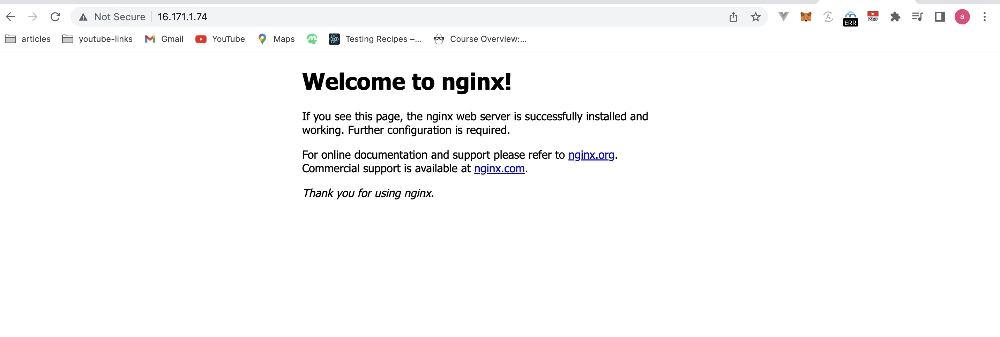

# Project1

# STEP 1

# Installing nginx web server

- run _sudo apt update_ to update server's index package
- run _sudo apt install apache2_ to install nginx server
  

# STEP 2

# Installing MYSQL

- run _sudo apt install mysql-server_ to install sql server
- run _sudo mysql_ to login to mysql console
- run **_ALTER USER 'root'@'localhost' IDENTIFIED WITH mysql_native_password BY 'PassWord.1';_** to set password for the root user using mysql\*native_password as default authentication method.
- exit MYSQL shell with \_msql > exit
- run _sudo mysql_secure_installation_ to start the interactive script running and follow prompt to validate password.
- With the steps above MYSQL server should be installed and secured.
  
  .png>)

# STEP 3

# Installing PHP

- run _sudo apt install php libapache2-mod-php php-mysql_ to install php, libapache2-mod-php, php-mysql at once.
- run _php -v_ to confirm php is installed.
  

# STEP 4

# Configuring nginx to use php processor

- run _sudo mkdir /var/www/projectLEMP_ to create a directory for projectlamp
- run _sudo chown -R $USER:$USER /var/www/projectlamp_ to assign ownership of the current system user.
- run _sudo nano /etc/nginx/sites-available/projectLEMP_ to open a configuration file in Nginx’s sites-available directory using your preferred command-line editor. Here, we’ll use nano.
- Add the snippet in the code block below in the file
- run _sudo ln -s /etc/nginx/sites-available/projectLEMP /etc/nginx/sites-enabled/_ to activate your configuration by linking to the config file from Nginx’s sites-enabled directory
- run _sudo unlink /etc/nginx/sites-enabled/default_ to disable default Nginx host that is currently configured to listen on our port(80).
- run _sudo systemctl reload nginx_ to apply changes.
- visit _http://<Public-IP-Address>:80_ in the browser to see the website.

  ```
      #/etc/nginx/sites-available/projectLEMP

      server {
      listen 80;
      server_name projectLEMP www.projectLEMP;
      root /var/www/projectLEMP;

      index index.html index.htm index.php;

      location / {
          try_files $uri $uri/ =404;
      }

      location ~ \.php$ {
          include snippets/fastcgi-php.conf;
          fastcgi_pass unix:/var/run/php/php8.1-fpm.sock;
      }

      location ~ /\.ht {
          deny all;
      }

  }
  ```

```

```


# STEP 5

# Testing php with nginx

- At this point LAMP stack is installed and operational. We can test to validate that nginx can correctly hand .php filesoff to the processor, create a test php file in your document root. run _sudo nano /var/www/projectLEMP/info.php_
- Type or paste the following lines into the new file. This is valid PHP code that will return information about your server:

  ```
      <?php
      phpinfo();

  ```

- You can now access this page in your web browser by visiting the domain name or public IP address you’ve set up in your Nginx configuration file, followed by /info.php:
  _http://`server_domain_or_IP`/info.php_

  

# Step 6

# Retrieving data from MYSQL database with php

- run _sudo mysql -p_ to connect to mysql
- run _CREATE DATABASE `example_database`;_ to create a new database.
- run _`CREATE USER 'example_user'@'%' IDENTIFIED WITH mysql_native_password BY 'password';`_ to creates a new user named example_user, using mysql_native_password as default authentication method. We’re defining this user’s password as password, but you should replace this value with a secure password of your own choosing.
- run _`GRANT ALL ON example_database.* TO 'example_user'@'%';`_ to give this user permission over the example_database database
- exit the MySQL shell with `mysql > exit`
- run `mysql -u example_user -p` to test if the new user has the proper permissions by logging in to the MySQL console again, this time using the custom user credentials:
- run _mysql> SHOW DATABASES;_ to show list of DB.
  -RUN `CREATE TABLE example_database.todo_list (item_id INT AUTO_INCREMENT,content VARCHAR(255),PRIMARY KEY(item_id));` to create a test table named todo_list.
- run `INSERT INTO example_database.todo_list (content) VALUES ("My first important item");` to insert rows of content in the table.
- run `SELECT * FROM example_database.todo_list;` to retrieve contents from the DB.
- exit mysql
- Now you can create a PHP script that will connect to MySQL and query for your content. Create a new PHP file in your custom web root directory using your preferred editor. We’ll use vi for that: run `nano /var/www/projectLEMP/todo_list.php` . Copy this content into your todo_list.php script:

  ```
      <?php
      $user = "example_user";
      $password = "password";
      $database = "example_database";
      $table = "todo_list";

      try {
      $db = new PDO("mysql:host=localhost;dbname=$database", $user, $password);
      echo "<h2>TODO</h2><ol>";
      foreach($db->query("SELECT content FROM $table") as $row) {
          echo "<li>" . $row['content'] . "</li>";
      }
      echo "</ol>";
      } catch (PDOException $e) {
          print "Error!: " . $e->getMessage() . "<br/>";
          die();
      }
  ```

- Save and close the file
- You can now access this page in your web browser by visiting the domain name or public IP address configured for your website, followed by /todo_list.php: `http://<Public_domain_or_IP>/todo_list.php`

.png>)
